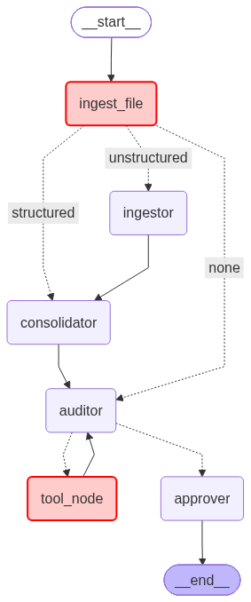

# Galatiq Case: Invoice Processing Automation

## Video Solution (Written Solution is Everything Below this Header)

[Video Walkthrough & Demo](https://youtu.be/-ifU7jX_p1w)

## Background

Acme Corp is a PE-backed manufacturing firm losing **$2M/year** on manual invoice processing. Invoices arrive via email as PDFs, txts, xmls, and other messy formats with frequent errors. Staff manually extract data, validate against a legacy inventory database (inconsistent), obtain VP approval (via email chains), and process payment (via a banking API).

**Current pain points:**
- 30% error rate
- 5-day processing delays
- Frustrated stakeholders

## Objective

Build a **multi-agent system** that automates the end-to-end invoice processing workflow.

## Workflow

Our current MVP multi-agent solution handles four stages:

1. **Ingestion** — Extract structured data from invoice documents. Our ingestion process detects the filetype and leverages Microsoft's `markitdown` package to convert all of the relevant information in the file to a format legible for LLMs to consume. This means that while our golden dataset only possesses .json, .txt, .pdf, .csv, and .pdf files, we can also handle documents such as images, html, zip files, excel files, and more. The ingestor is also customizable to accept only specific file types for consistency and safety. Our ingestion procedure also automatically recognizes whether our data is columnar or row-oriented.

2. **Validation** — Our solution has been validated against the invoices in `data/invoices` acting as our golden dataset. Ideally, we would generate more synthetic examples to further stress test our performance on wider distribution of possible invoices. For now, we can demonstrate that our agent is able to identify a pay/reject decision with 100% accuracy on the golden dataset and identify the processing result sublabel with X% accuracy.

3. **Approval** — Our agentic system has a data consolidator that populates the required fields of an invoice, an auditor who inspects the consolidated and raw data to make inferences about any potential red flags. Once the auditor feels comfortable with their assessment, and approver agent double checks the auditors work and compiles a final decision based on all available data.

4. **Payment** — Payments are processed upon the approver agent approving the invoice. Payments AND rejections are logged to our invoices table in `data/invoices.db`. 

## Technical Solution

Our approach is written primarily in Python, leveraging LangGraph as our orchestration framework and xAI's (MODEL NAME) as the primary LLM our agents rely on. 

LangGraph was chosen over other orchestrations (including LangChain) because the agentic system makes update to a shared and structured state. Furthermore, tool calls can be handled with more control. Tool calls can be rejected for undesirable inputs and are directly embedded into the control flow of the system. For our purposes of outputing a rigid structure for consistent invoice evlaution, LangChain is an incredible candidate.

For now, our agent runs locally, saving results in json files for simple evaluation and logging events in locally stored SQLite databases. 

Our example dataset also contains replicates. For security purposes, we do not ever upsert an invoice. Once an invoice number is processed, no invoice with the same identifier can go in its place. A new invoice with a new invoice number MUST be submitted. This way, retrieving an erroneous invoice is always possible without mutating or creating nested schemas.

### Architecture

<p align="center">
  
</p>

**Legend**

🟥 **Red rectangles** = Tools  
🟪 **Purple rectangles** = Agents

Every invoice gets processed by ingestor script. The ingester script determines one of three routes based on the document and features extracted. If the document type is not obviously tabular (.txt, .pdf, .docx, .md), then the data is considered "unstructured". It is converted into markdown using Microsoft's `markitdown` package and sent to the Ingestor Agent. The ingestor reads through the files and tries to populate the InvoiceState schema (see below).

In the event the data IS tabular/structured (.csv, .json, .xml, .xlsx), then our ingestor script will determine if the file is tall or wide, and then attempt to infill the InvoiceState schema in one shot. If it fails to do it or any of the following fields are missing (invoice_number, line_items, vendor, total), then the data is considered "structured". The data is sent to the Consolidator Agent to ensure that the fields of the InvoiceState are populated and of the correct type. The outputs from the ingestor also get sent to the consolidator for extra scrutiny of the structured data generated from unstructured sources. 

<details>
<summary><strong>📄 InvoiceState YAML Schema (<code>src/model_schemas/invoice.py</code>)</strong></summary>

```yaml
InvoiceState:
  type: object
  description: >
    Parsed invoice fields after unstructured or structured ingestion.
    All fields are optional and may be None if not found in the document.
  properties:
    invoice_number:
      type: string
      description: Invoice number, usually with the "INV-" prefix. REQUIRED field for downstream automation.
    revision:
      type: string
      description: Revision number of the invoice, if applicable.
    vendor:
      type: string
      description: Vendor (seller) name. REQUIRED field.
    vendor_address:
      type: string
      description: Vendor's business address.
    bill_to:
      type: string
      description: "Bill to" address for the recipient/purchaser.
    date:
      type: string
      description: Invoice issue date (ISO or original format).
    due_date:
      type: string
      description: Payment due date (ISO or original format).
    line_items:
      type: array
      items: 
        $ref: "#/LineItemState"
      description: List of invoice line items. REQUIRED field.
    subtotal:
      type: number
      description: Subtotal of all line items before tax, shipping, and fees.
    tax_rate:
      type: number
      description: Tax rate as a decimal (e.g., 0.10 for 10%).
    tax_amount:
      type: number
      description: Total tax amount in nominal value.
    shipping:
      type: number
      description: Shipping/handling amount, if separated from line items.
    total:
      type: number
      description: Total invoice amount. REQUIRED field.
    currency:
      type: string
      description: Three-letter currency code or currency symbol.
    payment_terms:
      type: string
      description: Terms for payment (e.g., "Net 30", "Due on receipt").
    notes:
      type: string
      description: Additional instructions or comments on the invoice.

LineItemState:
  type: object
  description: |
    (See `LineItemState` definition; fields not expanded here.)
```
</details>


Once the consolidator is finished, the Auditor Agent has all the relevant information about the invoice to start performing auditing checks. In **extremely** rare conditions, processing the file during `ingest_file` allows us to fully populate the InvoiceState in one-shot and we go straight to our Auditor Agent directly. It has tools to verify tax math, verify total invoice amount, calculate total invoice amount, perform an inventory check, verify date validity, and combine line items. With these tools, the auditor creates a report with a recommended course of action.

Lastly, the Approver Agent transforms the auditor's output into the OutputState schema and extracts the invoice processing decision, failure type category, reason for conclusion, and infers the confidence of the auditor's assessment.

With this, we have enough information to programatically handle invoices and assess our performance.

## Results

### Golden Dataset

While our example invoices contain 16 examples, only 8 of them were human-labeled for alignment. The golden dataset consists of the 8 invoices discussed in the table below:

| Scenario | Invoice | What should happen |
|---|---|---|
| Normal order within stock | INV-1001, INV-1004, INV-1006 | Items found, quantities valid — passes validation |
| Quantity exceeds stock | INV-1002 (requests 20× GadgetX, only 5 in stock) | Flagged as stock mismatch |
| Fraudulent / zero-stock item | INV-1003 (references FakeItem, 0 stock) | Flagged as out of stock or suspicious |
| Item not in database at all | INV-1008 (SuperGizmo, MegaSprocket), INV-1016 (WidgetC) | Flagged as unknown item |
| Invalid data | INV-1009 (negative quantity) | Flagged as data integrity issue |

With this knowledge, we assess our performance on ALL 16 outcomes, but matching the golden dataset is prioritized. The other 8 examples are evaluated against the expected outcomes we believe match the behavior of the golden dataset.

** Pay/Reject Results**

| Invoice Number | File Format | Expected Processing Result | Our Output | Match? | Golden Example? |
|---|---|---|---|:---:|:---:|
| INV-1001 | `.txt` | SUCCESS | SUCCESS |   ✅   |   🟡   |
| INV-1002 | `.txt` | FAILURE | FAILURE |   ✅   |   🟡   |
| INV-1003 | `.txt` | FAILURE | FAILURE |   ✅   |   🟡   |
| INV-1004 | `.json` | SUCCESS | SUCCESS |   ✅   |   🟡   |
| INV-1005 | `.json` | FAILURE | FAILURE |   ✅   |        |
| INV-1006 | `.csv` | SUCCESS | SUCCESS |   ✅   |   🟡   |
| INV-1007 | `.csv` | FAILURE | FAILURE |   ✅   |        |
| INV-1008 | `.txt` | FAILURE | FAILURE |   ✅   |   🟡   |
| INV-1009 | `.json` | FAILURE | FAILURE |   ✅   |   🟡   |
| INV-1010 | `.txt` | SUCCESS | SUCCESS |   ✅   |        |
| INV-1011 | `.pdf` | SUCCESS | SUCCESS |   ✅   |        |
| INV-1012 | `.pdf` | FAILURE | FAILURE |   ✅   |        |
| INV-1013 | `.pdf` | FAILURE | FAILURE |   ✅   |        |
| INV-1014 | `.xml` | SUCCESS | SUCCESS |   ✅   |        |
| INV-1015 | `.csv` | SUCCESS | SUCCESS |   ✅   |        |
| INV-1016 | `.json` | FAILURE | FAILURE |   ✅   |   🟡   |

Our binary results indicate a good initial performance, but how can we know if our agent is making these decision for the right reasons? Our final output isn't just a go/no-go decision for processing invoices. Our system outputs the following schema:

```yaml
OutputState:
  type: object
  description: The final output of our agentic system for invoice processing.
  properties:
    invoice_number:
      type: string
      description: Unique identifier for the invoice.
    vendor_name:
      type: string
      description: Name of the vendor associated with the invoice.
    amount:
      type: number
      format: float
      description: The total monetary amount of the invoice.
    processing_result:
      type: string
      enum:
        - SUCCESS
        - FAILURE
      description: >
        Binary outcome indicating if the invoice was processed successfully
        ("SUCCESS") or failed validation ("FAILURE").
    processing_result_sublabel:
      type: string
      enum:
        - SUCCESS
        - STOCK MISMATCH OR ITEM OUT OF STOCK
        - NONEXISTENT ITEM
        - INVALID QUANTITATIVE FIELD
        - MISSING OR SUSPICIOUS FIELD(S)
      description: >
        More detailed reason for the processing result.
        Indicates specific failure or success conditions.
    reason:
      type: string
      description: Human-readable explanation for the result.
    confidence:
      type: number
      format: float
      minimum: 0
      maximum: 1
      description: Confidence score (0 to 1) representing system certainty.
  required:
    - invoice_number
    - vendor_name
    - amount
    - processing_result
    - processing_result_sublabel
    - reason
    - confidence
```
This YAML schema matches the `OutputState` model as defined in `src/model_schemas/output.py`.  
It ensures structured, interpretable results for each invoice processed by the system. We can back out the outcome, category for the decision, additional agentic reasoning, and a confidence score. With these outputs, we can not only automate invoice processing, but programatically determine based on categories and confidence scores how to bring a human in the loop if it becomes necessary.

Here is how the system performed when trying to predict the sublabel (i.e. the category of the failure).

| Invoice Number | File Format | Expected Processing Sublabel | Our Output | Match? | Golden Example? |
|---|---|---|---|:---:|:---:|
| INV-1001 | `.txt` | SUCCESS | SUCCESS |   ✅   |   🟡   |
| INV-1002 | `.txt` | STOCK MISMATCH OR ITEM OUT OF STOCK | STOCK MISMATCH OR ITEM OUT OF STOCK |   ✅   |   🟡   |
| INV-1003 | `.txt` | STOCK MISMATCH OR ITEM OUT OF STOCK or MISSING OR SUSPICIOUS FIELD(S) | STOCK MISMATCH OR ITEM OUT OF STOCK |   ✅   |   🟡   |
| INV-1004 | `.json` | SUCCESS | SUCCESS |   ✅   |   🟡   |
| INV-1005 | `.json` | STOCK MISMATCH OR ITEM OUT OF STOCK | STOCK MISMATCH OR ITEM OUT OF STOCK |   ✅   |        |
| INV-1006 | `.csv` | SUCCESS | SUCCESS |   ✅   |   🟡   |
| INV-1007 | `.csv` | STOCK MISMATCH OR ITEM OUT OF STOCK | STOCK MISMATCH OR ITEM OUT OF STOCK |   ✅   |        |
| INV-1008 | `.txt` | NONEXISTENT ITEM | NONEXISTENT ITEM |   ✅   |   🟡   |
| INV-1009 | `.json` | INVALID QUANTITATIVE FIELD or MISSING OR SUSPICIOUS FIELD(S) | MISSING OR SUSPICIOUS FIELD(S) |   ✅   |   🟡   |
| INV-1010 | `.txt` | SUCCESS | SUCCESS |   ✅   |        |
| INV-1011 | `.pdf` | SUCCESS | SUCCESS |   ✅   |        |
| INV-1012 | `.pdf` | SUCCESS | SUCCESS |   ✅   |        |
| INV-1013 | `.pdf` | STOCK MISMATCH OR ITEM OUT OF STOCK | STOCK MISMATCH OR ITEM OUT OF STOCK |   ✅   |        |
| INV-1014 | `.xml` | SUCCESS | SUCCESS |   ✅   |        |
| INV-1015 | `.csv` | SUCCESS | SUCCESS |   ✅   |        |
| INV-1016 | `.json` | NONEXISTENT ITEM | NONEXISTENT ITEM |   ✅   |   🟡   |

## Running the System

To run the system, you can use the following command-line options (as parsed in `main.py`):

- **Process a Single Invoice File:**
  ```bash
  python main.py --invoice-path=data/invoices/invoice_1001.txt
  ```

- **Process All Invoices in the Dataset (default, no flags):**
  ```bash
  python main.py
  ```

- **Reset the Invoices Table:**
  ```bash
  python main.py --reset-invoices
  ```

- **Reset the Inventory Table:**
  ```bash
  python main.py --reset-inventory
  ```

- **Run Golden Dataset Test Suite Only (without processing invoices):**
  ```bash
  python main.py --test-only
  ```

You can mix and match these flags as needed; they all work completely independently. If you run the script **without any flags**, it will process all invoices found in the default `data/invoices/` folder.

All results are written to the invoices table in the SQLite database `data/invoices.db`.

## UI Experience

You can manually upload your invoices [on this dashboard](https://romankouz-galatiq-case-invoices.streamlit.app/) to see the multi-agent in action for yourself!

## Future Work

While our MVP indicates that leveraging a multi-agent framework for invoice processing is a promising direction, there are immediate steps we can take to improve the current system.

### Offline Fallback

In the event that any of our providers go down, we have no offline alternative to locally run our pipeline. Finding a suitable but small model from HuggingFace and using it if leveraging xAI's models is ever ineffective helps maintain uptime.

### Additional String Validation

The string validations for vendor names and line items is primarliy based on the faulty examples in the invoices dataset. There are likely substantial additions to make. If a product name had a previous name it went by, or a typo occurred but it was clear what the user meant to put in the invoice, those features are not presently supported.

### Generator/Discriminator Training

To fully stress test our solution, we should have both humans and AI generate invoices that are meant to trick our system. In doing so, our discriminator gets better at identifying passable invoices from ones that fail even when the discernability between an acceptable/rejectable invoice decreases.

### Update Invoice Formatting for the Whole Business

This agentic solution is a great short-term solution, but it's not a deterministic system and it has tremendous development upkeep. Long-term, I would pitch for Acme Corp to invest in creating a structured invoicing document that *must* be populated correctly before submission. This can easily turn this problem into one of software than one of AI Engineering, lowering the cost in the long-term. Clearly, the agentic solution is needed for right now because of the high error rate, high delays, and no auditing trail. However, investing in a strucutred invoice for the entire corporation going forward yields a simpler automation system to maintain while also increasing user accountability. Employees submitting invoices would interact directly with the required fields, making them more likely to notice inconsistencies, provide complete information, and explain exceptions when they arise.

## Evaluation Criteria

- **Functionality** — Does the system work end-to-end? ✅
- **Code Quality** — Clean, testable, well-structured code with error handling and observability ✅
- **Agentic Sophistication** — LLM integration, multi-agent flow, tool use, self-correction loops ✅
- **Shipping Mindset** — Valuable MVP delivered under ambiguity; scope ruthlessly cut where needed ✅
- **Presentation** — Clear translation of technical decisions to business impact ✅
- **Above/Beyond** - Have you made it your own? Implemented additional features that make the solution feel great? Expanded assumptions? Added to test cases? ✅
- **UI/UX** - Users will understand and enjoy using this system. ✅

### Sample Full Run Output

Resetting invoices table...
Creating invoices table...
Invoices table created successfully.
Processing invoice: invoice_1001.txt
UNSTRUCTURED INGESTOR AGENT ACTIVATED
CONSOLIDATOR AGENT ACTIVATED
AUDITING AGENT ACTIVATED
AUDITING AGENT ACTIVATED
APPROVING AGENT ACTIVATED
{'invoice_number': 'INV-1001', 'vendor_name': 'Widgets Inc.', 'amount': 5000.0, 'processing_result': 'SUCCESS', 'processing_result_sublabel': 'SUCCESS', 'reason': "The auditor's report confirms all required fields are present, line item calculations are accurate, inventory stock is sufficient for all items (WidgetA: 10 requested vs 15 available; WidgetB: 5 requested vs 10 available), dates are consistent, and there are no suspicious elements or inconsistencies. The recommendation is to approve for payment.", 'confidence': 0.95}
====================================================================================================
Processing invoice: invoice_1002.txt
UNSTRUCTURED INGESTOR AGENT ACTIVATED
CONSOLIDATOR AGENT ACTIVATED
AUDITING AGENT ACTIVATED
AUDITING AGENT ACTIVATED
APPROVING AGENT ACTIVATED
{'invoice_number': 'INV-1002', 'vendor_name': 'Gadgets Co.', 'amount': 15000.0, 'processing_result': 'FAILURE', 'processing_result_sublabel': 'STOCK MISMATCH OR ITEM OUT OF STOCK', 'reason': 'Quantity Check: FAIL – Requested 20 units of GadgetX, but only 5 available in stock. This exceeds inventory levels. (STOCK MISMATCH OR ITEM OUT OF STOCK). Other aspects like totals, tax, and item existence are valid, but suspicious elements (misspellings, abbreviations) noted though not definitive for failure.', 'confidence': 0.9}    
====================================================================================================
Processing invoice: invoice_1003.txt
UNSTRUCTURED INGESTOR AGENT ACTIVATED
CONSOLIDATOR AGENT ACTIVATED
AUDITING AGENT ACTIVATED
AUDITING AGENT ACTIVATED
APPROVING AGENT ACTIVATED
{'invoice_number': 'INV-1003', 'vendor_name': 'Fraudster LLC', 'amount': 100000.0, 'processing_result': 'FAILURE', 'processing_result_sublabel': 'STOCK MISMATCH OR ITEM OUT OF STOCK', 'reason': 'STOCK MISMATCH OR ITEM OUT OF STOCK: Requested quantity (100) exceeds available stock (0) for item "FakeItem". Also, suspicious vendor name ("Fraudster LLC"), urgent/scammy notes ("URGENT - Pay immediately... Wire transfer preferred."), invalid due date ("yesterday"), and future invoice date (2026) contribute to fraud indicators. No critical fields missing, totals calculate correctly.', 'confidence': 0.95}
====================================================================================================
Processing invoice: invoice_1004.json
CONSOLIDATOR AGENT ACTIVATED
AUDITING AGENT ACTIVATED
AUDITING AGENT ACTIVATED
APPROVING AGENT ACTIVATED
{'invoice_number': 'INV-1004', 'vendor_name': 'Precision Parts Ltd.', 'amount': 1890.0, 'processing_result': 'SUCCESS', 'processing_result_sublabel': 'SUCCESS', 'reason': "The auditor's report confirms all required fields are present, items exist in inventory with sufficient stock (WidgetA: 15>3, WidgetB: 10>2), quantities are valid, all calculations (line items, subtotal, tax, total) are correct, dates are consistent, no suspicious elements, and the recommendation is to approve for payment.", 'confidence': 0.95}
====================================================================================================
Processing invoice: invoice_1004_revised.json
CONSOLIDATOR AGENT ACTIVATED
AUDITING AGENT ACTIVATED
AUDITING AGENT ACTIVATED
APPROVING AGENT ACTIVATED
C:\Users\Owner\Documents\Employment Documents\galatiq-case-invoices\data\invoices.py:59: UserWarning: Invoice 'INV-1004' already exists in the database. Skipping this invoice.
  warnings.warn(f"Invoice '{invoice_number}' already exists in the database. Skipping this invoice.")
Invoice 'INV-1004' already exists in the database. Cannot process it again.
Processing invoice: invoice_1005.json
CONSOLIDATOR AGENT ACTIVATED
AUDITING AGENT ACTIVATED
AUDITING AGENT ACTIVATED
APPROVING AGENT ACTIVATED
{'invoice_number': 'INV-1005', 'vendor_name': 'Global Supply Chain Partners', 'amount': 15225.0, 'processing_result': 'FAILURE', 'processing_result_sublabel': 'STOCK MISMATCH OR ITEM OUT OF STOCK', 'reason': 'STOCK MISMATCH OR ITEM OUT OF STOCK: GadgetX requested 8 but only 5 available in inventory. Other items (WidgetA and WidgetB) have sufficient stock. Calculations and totals are verified as correct. Some fields are missing (bill_to, shipping, notes, revision, individual line item amounts) but are reconstructible and not suspicious.', 'confidence': 0.95}
====================================================================================================
Processing invoice: invoice_1006.csv
AUDITING AGENT ACTIVATED
AUDITING AGENT ACTIVATED
APPROVING AGENT ACTIVATED
{'invoice_number': 'INV-1006', 'vendor_name': 'Acme Industrial Supplies', 'amount': 2750.0, 'processing_result': 'SUCCESS', 'processing_result_sublabel': 'SUCCESS', 'reason': "The auditor's report confirms all required fields are present, items exist in inventory, quantities are valid and within stock, total and tax calculations are correct, and there are no suspicious items or anomalies. The invoice is fully valid and should be approved for payment.", 'confidence': 0.95}
====================================================================================================
Processing invoice: invoice_1007.csv
CONSOLIDATOR AGENT ACTIVATED
AUDITING AGENT ACTIVATED
AUDITING AGENT ACTIVATED
APPROVING AGENT ACTIVATED
{'invoice_number': 'INV-1007', 'vendor_name': 'MegaWidgets Corp', 'amount': 14750.0, 'processing_result': 'FAILURE', 'processing_result_sublabel': 'STOCK MISMATCH OR ITEM OUT OF STOCK', 'reason': 'The invoice is invalid primarily due to over-ordering on inventory (WidgetA and WidgetB). Quantities exceed inventory: WidgetA requested 20 but only 15 in stock, WidgetB requested 15 but only 10 in stock. This violates business practices and should prevent payment. Additionally, total is missing (though calculable as 14750).', 'confidence': 0.9}
====================================================================================================
Processing invoice: invoice_1008.txt
UNSTRUCTURED INGESTOR AGENT ACTIVATED
CONSOLIDATOR AGENT ACTIVATED
AUDITING AGENT ACTIVATED
AUDITING AGENT ACTIVATED
APPROVING AGENT ACTIVATED
{'invoice_number': 'INV-1008', 'vendor_name': 'NoProd Industries', 'amount': 9900.0, 'processing_result': 'FAILURE', 'processing_result_sublabel': 'NONEXISTENT ITEM', 'reason': 'The items requested ("SuperGizmo" and "MegaSprocket") have no matching entries in the inventory database (query_inventory returned None for each; verify_quantities shows empty candidate matches and invalid quantities). This is a critical flag: Requested items do not exist in inventory, and quantities cannot be validated against stock levels. This violates business practices for a legitimate invoice. Calculations and required fields are otherwise correct.', 'confidence': 0.9}
====================================================================================================
Processing invoice: invoice_1009.json
CONSOLIDATOR AGENT ACTIVATED
AUDITING AGENT ACTIVATED
AUDITING AGENT ACTIVATED
APPROVING AGENT ACTIVATED
{'invoice_number': 'INV-1009', 'vendor_name': 'null', 'amount': -250.0, 'processing_result': 'FAILURE', 'processing_result_sublabel': 'MISSING OR SUSPICIOUS FIELD(S)', 'reason': 'missing vendor name; mismatched total (calculated 1000.0 vs provided -250.0); suspicious negative total and quantity (possible undocumented credit/refund)', 'confidence': 0.85}
====================================================================================================
Processing invoice: invoice_1010.txt
UNSTRUCTURED INGESTOR AGENT ACTIVATED
CONSOLIDATOR AGENT ACTIVATED
AUDITING AGENT ACTIVATED
AUDITING AGENT ACTIVATED
AUDITING AGENT ACTIVATED
APPROVING AGENT ACTIVATED
{'invoice_number': 'INV-1010', 'vendor_name': 'Consolidated Materials Group', 'amount': 7185.0, 'processing_result': 'SUCCESS', 'processing_result_sublabel': 'SUCCESS', 'reason': "The auditor's report confirms all required fields are present, items are identifiable (including fuzzy matching for variants), quantities are within inventory limits (with aggregation for WidgetA variants), all calculations (line items, subtotal, tax, total) match and pass verification functions, dates are consistent with terms, and no suspicious patterns exist. Conclusion: fully valid and approved for payment.", 'confidence': 0.95}
====================================================================================================
Processing invoice: invoice_1011.pdf
UNSTRUCTURED INGESTOR AGENT ACTIVATED
CONSOLIDATOR AGENT ACTIVATED
AUDITING AGENT ACTIVATED
AUDITING AGENT ACTIVATED
APPROVING AGENT ACTIVATED
{'invoice_number': 'INV-1011', 'vendor_name': 'Summit Manufacturing Co.', 'amount': 3000.0, 'processing_result': 'SUCCESS', 'processing_result_sublabel': 'SUCCESS', 'reason': "The auditor's report confirms all required fields are present, items match inventory directly, totals and tax calculations are correct, quantities are within available stock, and no suspicious elements or inconsistencies exist. The recommendation is to approve for payment.", 'confidence': 0.95}
====================================================================================================
Processing invoice: invoice_1011.txt
UNSTRUCTURED INGESTOR AGENT ACTIVATED
CONSOLIDATOR AGENT ACTIVATED
AUDITING AGENT ACTIVATED
AUDITING AGENT ACTIVATED
APPROVING AGENT ACTIVATED
C:\Users\Owner\Documents\Employment Documents\galatiq-case-invoices\data\invoices.py:59: UserWarning: Invoice 'INV-1011' already exists in the database. Skipping this invoice.
  warnings.warn(f"Invoice '{invoice_number}' already exists in the database. Skipping this invoice.")
Invoice 'INV-1011' already exists in the database. Cannot process it again.
Processing invoice: invoice_1012.pdf
UNSTRUCTURED INGESTOR AGENT ACTIVATED
CONSOLIDATOR AGENT ACTIVATED
AUDITING AGENT ACTIVATED
AUDITING AGENT ACTIVATED
APPROVING AGENT ACTIVATED
{'invoice_number': 'INV 1012', 'vendor_name': 'QuickShip Distributers (formerly FastShip Ltd.)', 'amount': 9975.0, 'processing_result': 'SUCCESS', 'processing_result_sublabel': 'SUCCESS', 'reason': "The auditor's report confirms all required fields are present, items match inventory with sufficient stock, all calculations (line items, subtotal, tax, total) are correct, minor typos and vendor name variation are non-suspicious, and there are no red flags. Recommendation is to approve for payment.", 'confidence': 0.95}       
====================================================================================================
Processing invoice: invoice_1012.txt
UNSTRUCTURED INGESTOR AGENT ACTIVATED
CONSOLIDATOR AGENT ACTIVATED
AUDITING AGENT ACTIVATED
AUDITING AGENT ACTIVATED
APPROVING AGENT ACTIVATED
C:\Users\Owner\Documents\Employment Documents\galatiq-case-invoices\data\invoices.py:59: UserWarning: Invoice 'INV 1012' already exists in the database. Skipping this invoice.
  warnings.warn(f"Invoice '{invoice_number}' already exists in the database. Skipping this invoice.")
Invoice 'INV 1012' already exists in the database. Cannot process it again.
Processing invoice: invoice_1013.json
CONSOLIDATOR AGENT ACTIVATED
AUDITING AGENT ACTIVATED
AUDITING AGENT ACTIVATED
APPROVING AGENT ACTIVATED
{'invoice_number': 'INV-1013', 'vendor_name': 'Atlas Industrial Supply', 'amount': 22562.8, 'processing_result': 'FAILURE', 'processing_result_sublabel': 'STOCK MISMATCH OR ITEM OUT OF STOCK', 'reason': 'Quantities exceed inventory for WidgetA (22>15), WidgetB (18>10), GadgetX (9>5); total mismatch (22562.8 vs expected 22512.8); missing bill_to field.', 'confidence': 0.9}
====================================================================================================
Processing invoice: invoice_1013.pdf
UNSTRUCTURED INGESTOR AGENT ACTIVATED
CONSOLIDATOR AGENT ACTIVATED
AUDITING AGENT ACTIVATED
AUDITING AGENT ACTIVATED
APPROVING AGENT ACTIVATED
C:\Users\Owner\Documents\Employment Documents\galatiq-case-invoices\data\invoices.py:59: UserWarning: Invoice 'INV-1013' already exists in the database. Skipping this invoice.
  warnings.warn(f"Invoice '{invoice_number}' already exists in the database. Skipping this invoice.")
Invoice 'INV-1013' already exists in the database. Cannot process it again.
Processing invoice: invoice_1014.xml
CONSOLIDATOR AGENT ACTIVATED
AUDITING AGENT ACTIVATED
AUDITING AGENT ACTIVATED
APPROVING AGENT ACTIVATED
{'invoice_number': 'INV-1014', 'vendor_name': 'TechParts International', 'amount': 4125.0, 'processing_result': 'SUCCESS', 'processing_result_sublabel': 'SUCCESS', 'reason': "The auditor's report confirms all required fields are present, items exist in inventory with sufficient stock (WidgetA: 4 ≤ 15, WidgetB: 6 ≤ 10), all calculations are correct (line items, subtotal, tax, total), dates are consistent with payment terms, and there are no red flags. The invoice is valid and ready for payment.", 'confidence': 0.95}        
====================================================================================================
Processing invoice: invoice_1015.csv
CONSOLIDATOR AGENT ACTIVATED
AUDITING AGENT ACTIVATED
AUDITING AGENT ACTIVATED
APPROVING AGENT ACTIVATED
{'invoice_number': 'INV-1015', 'vendor_name': 'Reliable Components Inc.', 'amount': 6500.0, 'processing_result': 'SUCCESS', 'processing_result_sublabel': 'SUCCESS', 'reason': "The auditor's report confirms all required fields are present, calculations for line items, subtotal, tax, and total are accurate, inventory checks show sufficient stock for all items (WidgetA: 10/15, WidgetB: 5/10, GadgetX: 2/5), dates are consistent, and no suspicious patterns or missing fields. Recommendation is to approve for payment.", 'confidence': 0.95}
====================================================================================================
Processing invoice: invoice_1016.json
CONSOLIDATOR AGENT ACTIVATED
AUDITING AGENT ACTIVATED
AUDITING AGENT ACTIVATED
APPROVING AGENT ACTIVATED
{'invoice_number': 'INV-1016', 'vendor_name': 'Widgets Inc.', 'amount': 3233.0, 'processing_result': 'FAILURE', 'processing_result_sublabel': 'NONEXISTENT ITEM', 'reason': 'WidgetC is not found in inventory (no matching record found, even with fuzzy matching). Requested quantity cannot be fulfilled. This is a critical issue that prevents full order fulfillment.', 'confidence': 0.9}
====================================================================================================
Paid 5000.0 to Widgets Inc.
Rejected 15000.0 from Gadgets Co.
Rejected 100000.0 from Fraudster LLC
Paid 1890.0 to Precision Parts Ltd.
Rejected 15225.0 from Global Supply Chain Partners
Paid 2750.0 to Acme Industrial Supplies
Rejected 14750.0 from MegaWidgets Corp
Rejected 9900.0 from NoProd Industries
Rejected -250.0 from null
Paid 7185.0 to Consolidated Materials Group
Paid 3000.0 to Summit Manufacturing Co.
Paid 9975.0 to QuickShip Distributers (formerly FastShip Ltd.)
Rejected 22562.8 from Atlas Industrial Supply
Paid 4125.0 to TechParts International
Paid 6500.0 to Reliable Components Inc.
Rejected 3233.0 from Widgets Inc.
Received predictions: ['INV-1004', 'INV-1006', 'INV-1003', 'INV-1009', 'INV-1008', 'INV-1016', 'INV-1002', 'INV-1001']
{'accuracy': 1.0, 'sublabel_accuracy': 1.0, 'confidence_difference': -0.002500000000000016}